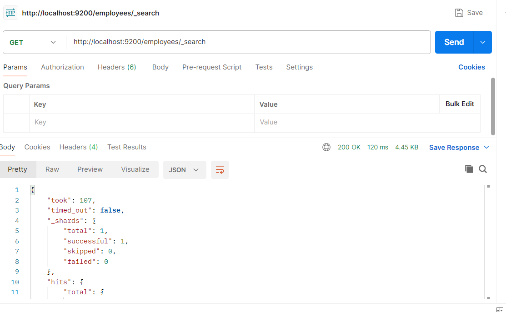

Jllrc swagger for task 3 available at\
http://localhost:8080/swagger-ui.html \
Start the app by running JllrcEmployeeManagementApplication.java

Task completion report as required by task 1-3

1-3\
getAllRecords\

getEmployeeById\

createAndGetEmployee\

multiget\

automaticMapping\

skillUpdate\

deleteEmployee\

2-1\
1.\

2.\

3.\

4.\

5.\

6.\

7.\

8.\

9.\

10.\

11.\

2-2\
1.\

2.\

3.\

4.\

2-3\
1.\

2.\

2-4\
1.\
